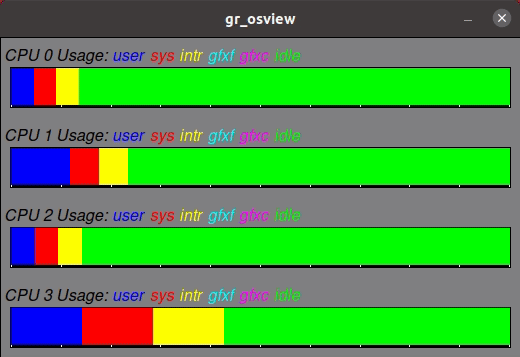

# gr_osview
Graphical operating system view

A rough visual clone of the SGI gr_osview utility.



This is what it looked like on the SGI workstations: https://www.youtube.com/watch?v=HsL1Dfa5W8o

## Installation

### Linux
Install Python 3 and TCL/TK toolkit:
```
sudo apt-get update
sudo apt-get install python3.8 python3-tk
```

Get this code:
```
git clone git@github.com:fdachille/gr_osview.git
```

Run:
```
cd gr_osview
python3.8 main.py
```
